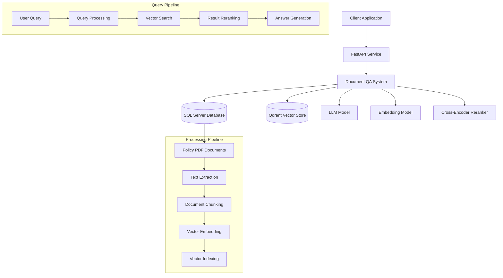
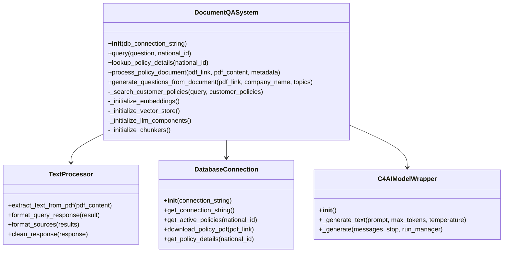
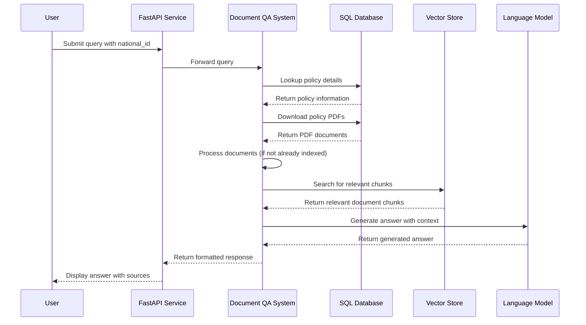
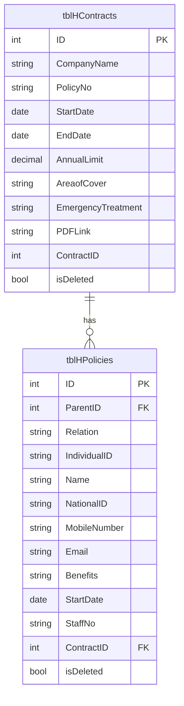

# Prometheus - Insurance Document QA System

## Table of Contents
- [Overview](#overview)
- [System Architecture](#system-architecture)
- [Core Components](#core-components)
- [Data Flow](#data-flow)
- [API Endpoints](#api-endpoints)
- [Database Schema](#database-schema)
- [Installation and Setup](#installation-and-setup)
- [Usage Guide](#usage-guide)
- [Development and Maintenance](#development-and-maintenance)

## Overview

Prometheus is an advanced document question-answering system designed specifically for insurance policy documents. It enables users to query their insurance policies using natural language and receive accurate, contextually relevant answers based on the content of their policy documents.

The system integrates with a SQL Server database to retrieve policy information and documents, processes these documents using advanced NLP techniques, and provides a FastAPI-based interface for querying the system.

## System Architecture



## Core Components

### 1. Document QA System

The `DocumentQASystem` class is the central component that orchestrates the entire system. It handles:

- Document processing and indexing
- Query processing
- Vector search and retrieval
- Answer generation



### 2. LLM Integration

The system uses a custom wrapper for the C4AI model to generate responses:

- `C4AIModelWrapper`: Provides an interface to the C4AI model with CUDA support
- Handles prompt formatting, token generation, and response processing
- Implements error handling and memory management for GPU operations

### 3. Document Processing

The system processes documents through several stages:

- Text extraction from PDFs
- Hierarchical chunking using `RecursiveChunker`, `SemanticChunker`, and `TokenChunker`
- Vector embedding generation
- Storage in Qdrant vector database

### 4. Search and Retrieval

The system implements a sophisticated search and retrieval pipeline:

- Vector similarity search using Qdrant
- BM25 keyword-based search as a fallback
- Cross-encoder reranking for improved relevance
- Hybrid search combining multiple approaches

### 5. API Layer

The FastAPI application provides endpoints for:

- Querying the system with natural language questions
- Retrieving policy details for a specific national ID
- Generating suggested questions based on policy documents

## Data Flow



## API Endpoints

### 1. Query Endpoint

```
POST /api/query
```

Processes natural language questions about insurance policies.

**Request Body:**
```json
{
  "question": "What is my dental coverage limit?",
  "national_id": "12345678901",
  "system_prompt": "Optional custom system prompt"
}
```

**Response:**
```json
{
  "answer": "Your dental coverage has an annual limit of QR 2,000...",
  "sources": [
    {
      "content": "Dental treatment is covered up to QR 2,000 per year...",
      "source": "policy_document.pdf",
      "score": 0.92
    }
  ]
}
```

### 2. Suggestions Endpoint

```
POST /api/suggestions
```

Generates suggested questions based on a user's policy documents.

**Request Body:**
```json
{
  "national_id": "12345678901"
}
```

**Response:**
```json
{
  "questions": [
    "What is my annual coverage limit?",
    "Are dental procedures covered under my policy?",
    "What is the co-payment percentage for outpatient services?"
  ]
}
```

## Database Schema

The system interacts with the following key database tables:



## Installation and Setup

### Prerequisites

- Python 3.9+
- CUDA-compatible GPU (for optimal performance)
- SQL Server with ODBC Driver 18
- 16GB+ RAM

### Installation Steps

1. Clone the repository:
   ```bash
   git clone https://github.com/your-org/prometheus.git
   cd prometheus
   ```

2. Create and activate a virtual environment:
   ```bash
   python -m venv venv
   source venv/bin/activate  # On Windows: venv\Scripts\activate
   ```

3. Install dependencies:
   ```bash
   pip install -r requirements.txt
   ```

4. Configure database connection in `db_utils.py` if needed.

5. Run the application:
   ```bash
   python app.py
   ```

## Usage Guide

### Indexing Documents

To index or reindex all policy documents:

```bash
python reindex.py --reset
```

The `--reset` flag will clear existing indices before reindexing.

### Downloading Policy Documents

To download all policy documents from the database:

```bash
python download_pdf.py
```

### Querying the System

You can query the system through the API endpoints or by using the provided UI at `http://localhost:5000`.

## Development and Maintenance

### Adding New Features

1. Extend the `DocumentQASystem` class for core functionality
2. Add new API endpoints in `app.py`
3. Update database queries in `db_utils.py` as needed

### Troubleshooting

Common issues:

- **GPU Memory Errors**: Adjust batch sizes or model parameters in `C4AIModelWrapper`
- **Database Connection Issues**: Check connection string and ODBC driver installation
- **PDF Processing Errors**: Ensure PDF documents are valid and accessible

### Performance Optimization

- Use the `--reset` flag with `reindex.py` to rebuild indices with optimized settings
- Adjust chunking parameters in `_initialize_chunkers()` for better document segmentation
- Modify vector search parameters for better retrieval quality

## Security Considerations

- The system currently uses hardcoded database credentials in `db_utils.py`
- API endpoints have CORS enabled for all origins in development mode
- PDF documents are downloaded with SSL verification disabled for internal URLs

For production deployment, consider:
- Using environment variables for sensitive configuration
- Restricting CORS to specific origins
- Enabling SSL verification for all external requests
- Implementing proper authentication and authorization
