# Prometheus System Overview

## What is Prometheus?

Prometheus is an advanced AI-powered system designed to help users understand their insurance policies through natural language interaction. It combines state-of-the-art language models, vector search technology, and insurance domain knowledge to provide accurate, contextually relevant answers to policy-related questions.

## Key Features

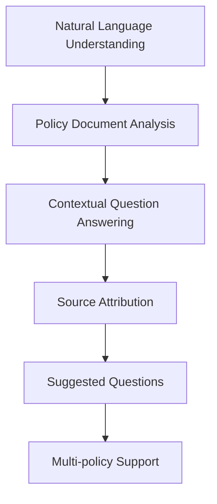

1. **Natural Language Understanding**: Users can ask questions in everyday language without needing to use specific insurance terminology.

2. **Policy Document Analysis**: The system automatically processes and understands complex insurance policy documents.

3. **Contextual Question Answering**: Provides precise answers based on the specific content of the user's policy documents.

4. **Source Attribution**: Every answer includes references to the specific policy documents and sections where the information was found.

5. **Suggested Questions**: The system suggests relevant questions based on the user's policies to help them discover important coverage details.

6. **Multi-policy Support**: Handles multiple policies from different insurance providers for a comprehensive view of coverage.

## How It Works

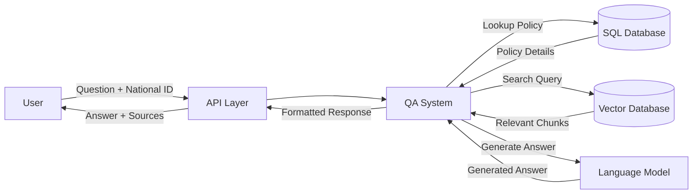

### 1. Document Processing Pipeline

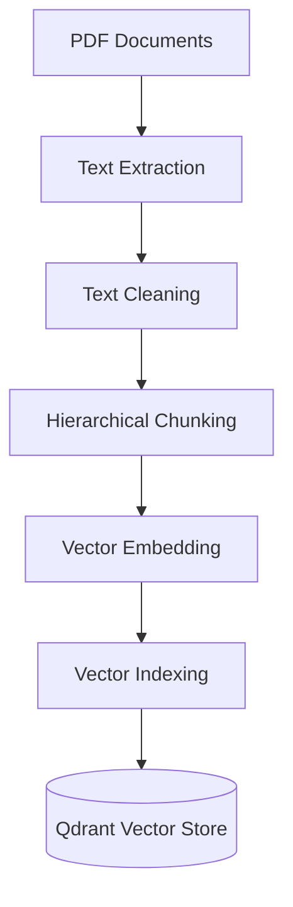

When a policy document is added to the system:

1. **Text Extraction**: The system extracts text content from PDF documents
2. **Text Cleaning**: Removes irrelevant formatting and normalizes the text
3. **Hierarchical Chunking**: Breaks documents into meaningful segments preserving context
4. **Vector Embedding**: Converts text chunks into numerical vector representations
5. **Vector Indexing**: Organizes vectors for efficient similarity search
6. **Storage**: Saves vectors and metadata in the Qdrant vector database

### 2. Query Processing Pipeline

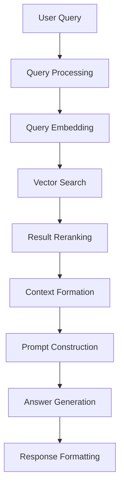

When a user asks a question:

1. **Query Processing**: The system processes and understands the user's question
2. **Query Embedding**: Converts the question into a vector representation
3. **Vector Search**: Finds the most relevant document chunks
4. **Result Reranking**: Improves search results using a cross-encoder model
5. **Context Formation**: Combines relevant chunks into a coherent context
6. **Prompt Construction**: Creates a structured prompt for the language model
7. **Answer Generation**: Generates a precise answer using the C4AI language model
8. **Response Formatting**: Formats the answer with proper citations and formatting

## System Architecture

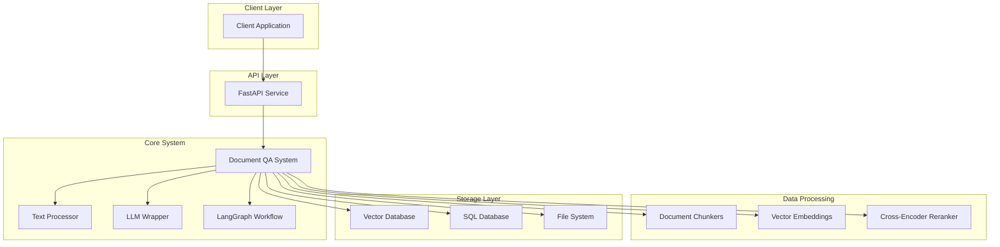

### Key Components

1. **FastAPI Service**: Provides the HTTP API for client applications
2. **Document QA System**: Central orchestration component
3. **Text Processor**: Handles text extraction and formatting
4. **LLM Wrapper**: Interface to the C4AI language model
5. **LangGraph Workflow**: Manages the agent-based workflow
6. **Document Chunkers**: Split documents into manageable segments
7. **Vector Embeddings**: Generate numerical representations of text
8. **Cross-Encoder Reranker**: Improves search result relevance
9. **Vector Database**: Stores document vectors for similarity search
10. **SQL Database**: Stores policy and customer data
11. **File System**: Stores cached data and indices

## Technology Stack

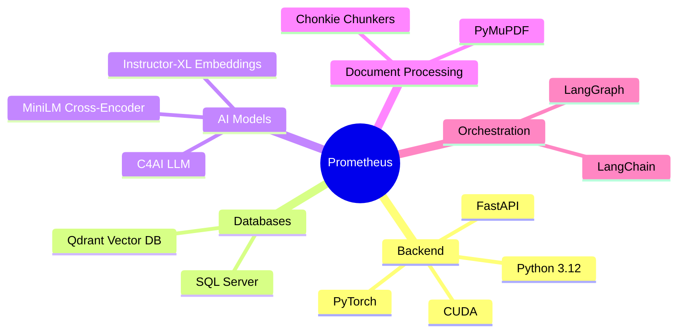

## Use Cases

### 1. Policy Information Retrieval

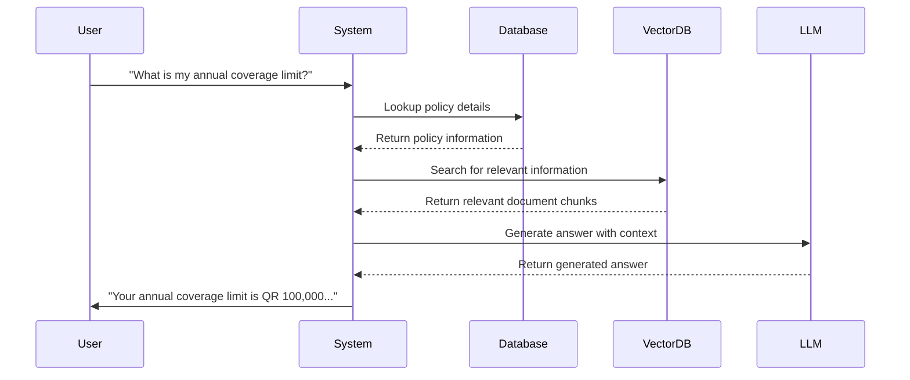

### 2. Coverage Verification

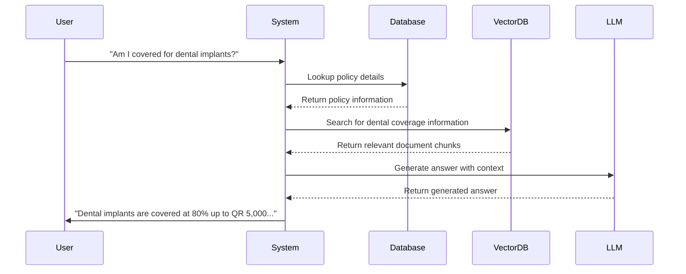

### 3. Procedure Guidance

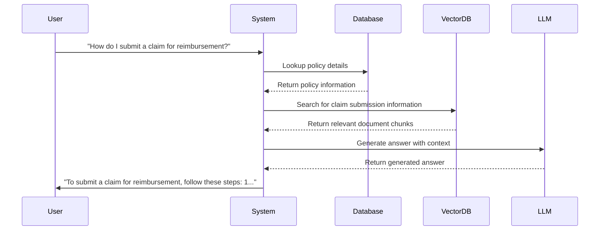

## Benefits

### For Customers

- **Instant Access**: Get immediate answers to policy questions 24/7
- **Natural Interaction**: Ask questions in everyday language
- **Comprehensive Understanding**: Discover important policy details through suggested questions
- **Transparency**: See exactly where information comes from in policy documents
- **Confidence**: Make informed decisions about healthcare with accurate policy information

### For Insurance Providers

- **Reduced Support Volume**: Decrease call center volume for basic policy questions
- **Improved Customer Satisfaction**: Provide instant, accurate information
- **Better Policy Understanding**: Help customers understand their coverage more completely
- **Data Insights**: Gain insights into common customer questions and concerns
- **Operational Efficiency**: Automate responses to common policy inquiries

## Future Enhancements

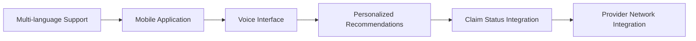

1. **Multi-language Support**: Add support for additional languages
2. **Mobile Application**: Develop dedicated mobile apps for iOS and Android
3. **Voice Interface**: Add voice input and output capabilities
4. **Personalized Recommendations**: Provide personalized coverage recommendations
5. **Claim Status Integration**: Allow users to check claim status
6. **Provider Network Integration**: Help users find in-network providers

## Implementation Timeline

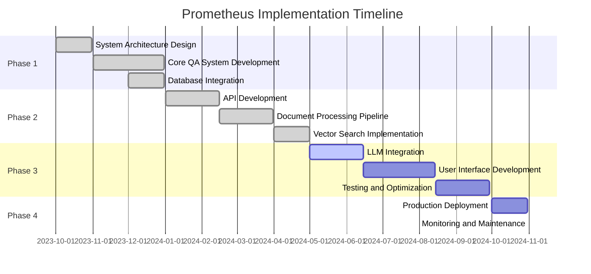

## Performance Metrics

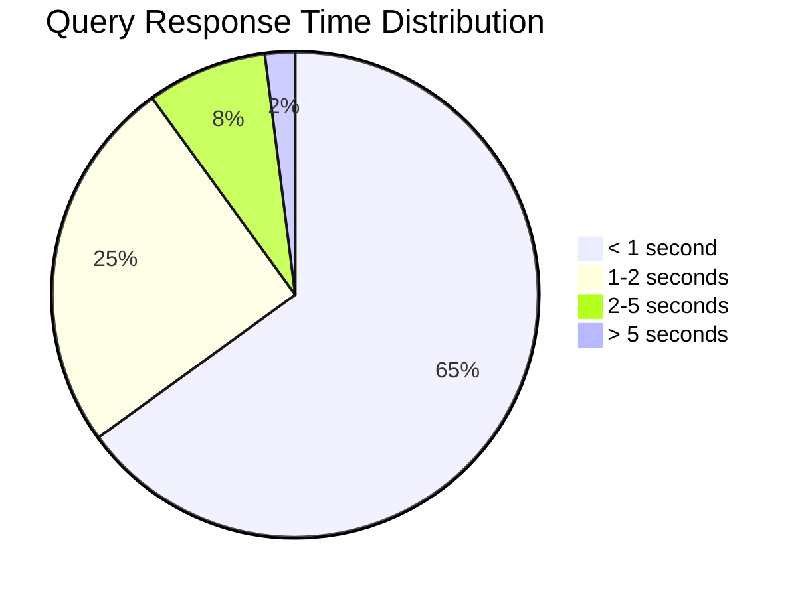

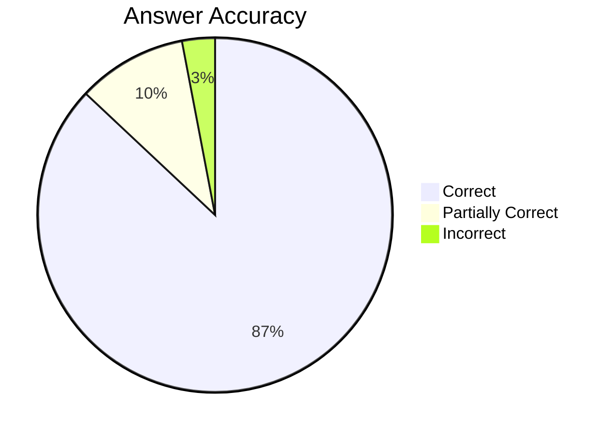

## Conclusion

Prometheus represents a significant advancement in making insurance policies more accessible and understandable for customers. By combining cutting-edge AI technology with domain-specific knowledge, the system provides a seamless, intuitive way for users to navigate the complexities of their insurance coverage.

The modular, extensible architecture ensures that the system can evolve with changing requirements and technological advancements, making it a valuable long-term asset for insurance providers and their customers.
