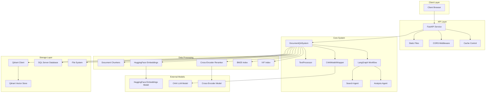
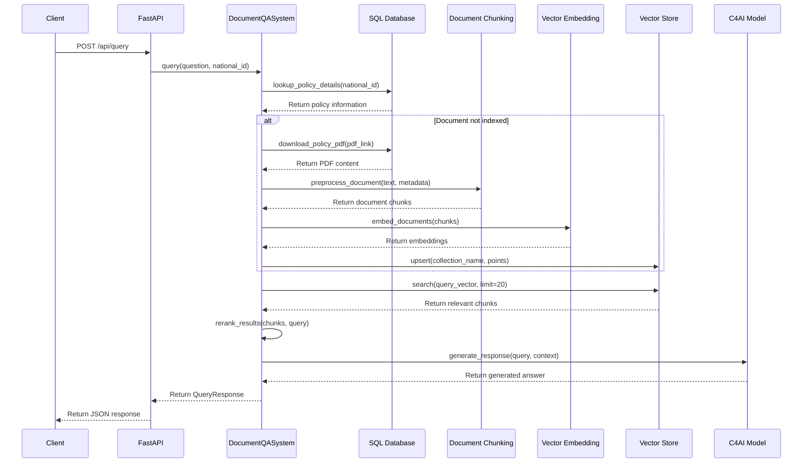
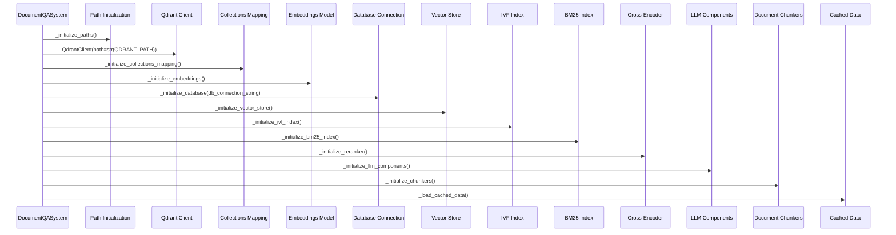
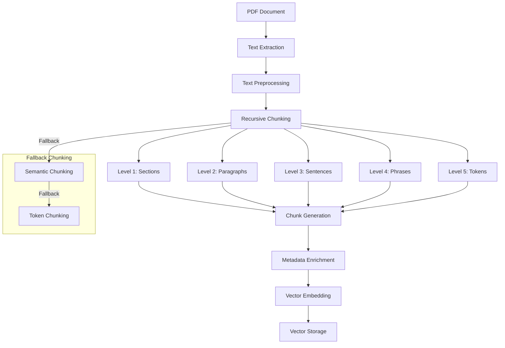
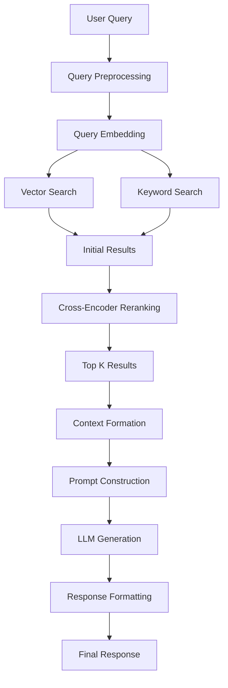
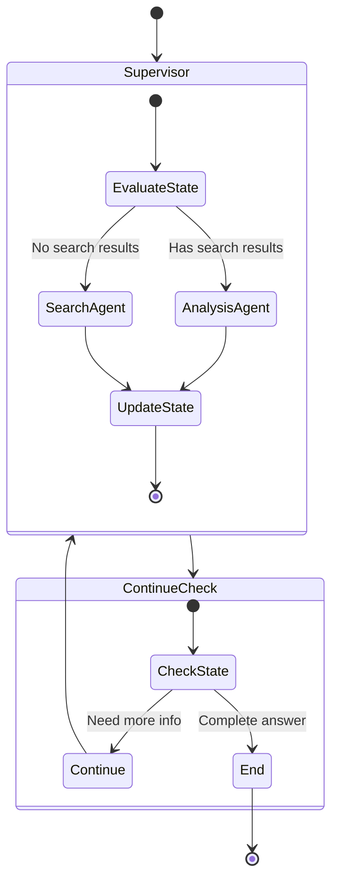
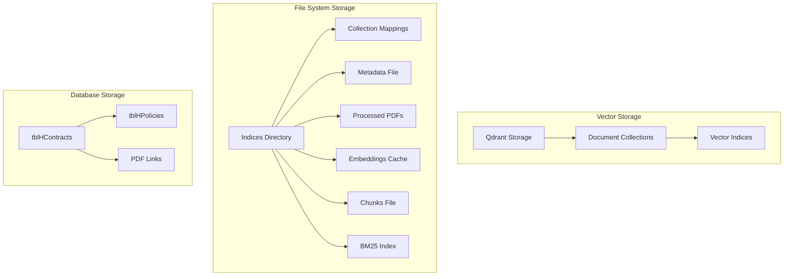
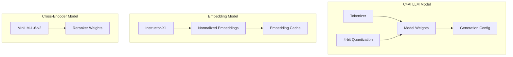

# Prometheus Technical Architecture

## System Components and Interactions

## Component Details

### API Layer

| Component | Description | Implementation |
|-----------|-------------|----------------|
| FastAPI Service | Main API server handling HTTP requests | FastAPI framework with async endpoints |
| Static Files | Serves static web assets | FastAPI StaticFiles middleware |
| CORS Middleware | Handles cross-origin requests | CORSMiddleware with configurable origins |
| Cache Control | Manages caching of static assets | Custom HTTP middleware |

### Core System

| Component | Description | Implementation |
|-----------|-------------|----------------|
| DocumentQASystem | Central orchestration component | Python class with initialization sequence |
| TextProcessor | Handles text extraction and formatting | Utility class with PDF processing methods |
| C4AIModelWrapper | Interface to LLM model | Custom wrapper for HuggingFace models with CUDA support |
| LangGraph Workflow | Manages the agent workflow | StateGraph with supervisor function |
| Search Agent | Specialized agent for document search | ReAct agent with custom prompt |
| Analysis Agent | Specialized agent for answer generation | ReAct agent with custom prompt |

### Data Processing

| Component | Description | Implementation |
|-----------|-------------|----------------|
| Document Chunkers | Split documents into manageable chunks | Hierarchical chunking with RecursiveChunker, SemanticChunker, TokenChunker |
| HuggingFace Embeddings | Generates vector embeddings | HuggingFaceEmbeddings with instructor-xl model |
| Cross-Encoder Reranker | Reranks search results | MiniLM cross-encoder model |
| BM25 Index | Keyword-based search index | BM25Okapi implementation |
| IVF Index | Approximate nearest neighbor search | CUVS IVF-Flat index |

### Storage Layer

| Component | Description | Implementation |
|-----------|-------------|----------------|
| Qdrant Client | Interface to vector database | QdrantClient with local storage |
| Qdrant Vector Store | Stores document vectors | Collection-based storage with DOT distance |
| SQL Server Database | Stores policy and customer data | ODBC connection to SQL Server |
| File System | Stores cached data and indices | Local file system with Path management |

### External Models

| Component | Description | Implementation |
|-----------|-------------|----------------|
| HuggingFace Embeddings Model | Generates semantic embeddings | instructor-xl model |
| C4AI LLM Model | Generates natural language responses | c4ai-command-r7b-12-2024-4bit model with 4-bit quantization |
| Cross-Encoder Model | Reranks search results | ms-marco-MiniLM-L-12-v2 model |

## Data Flow Sequence

## Initialization Sequence

## Document Processing Pipeline

## Query Processing Pipeline

## LangGraph Agent Workflow

## Storage Architecture

## Model Architecture

